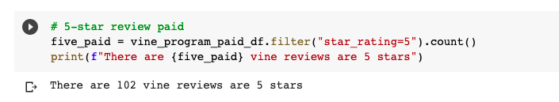
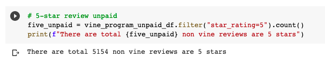
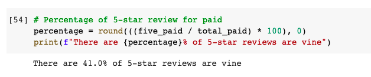
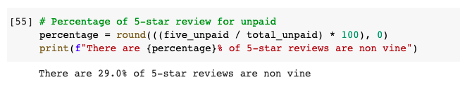

# Amazon_Vine_Analysis

# Overview:
Use Google Colab to help $ellby to analyze the product on leading retail website. There are a thousand reviews on website, and they are in word but they want to compare their products with their competitor product.

# Results:

## Total reviews:
Vine: 248 reviews
	
	
	
 Non-Vine: 17514 reviews
	
	
	
## Total 5 stars:
102 vine reviews are 5 stars 

5154 non-vine reviews are 5 stars 

## Percentage:
41.0% of 5-star reviews are vine

29.0% of 5-star reviews are non vine	

# Summary: 
There are 41% of 5 star reviews are paid and 29% of 5 stars products are unpaid. It means more customers choose products of $ellby company. Therefore, we don’t need any positivity bias for reviews in the Vine program. But I would recommend they could do the frequency analyze like how often that the customers use their products based on the reviews. 
	
